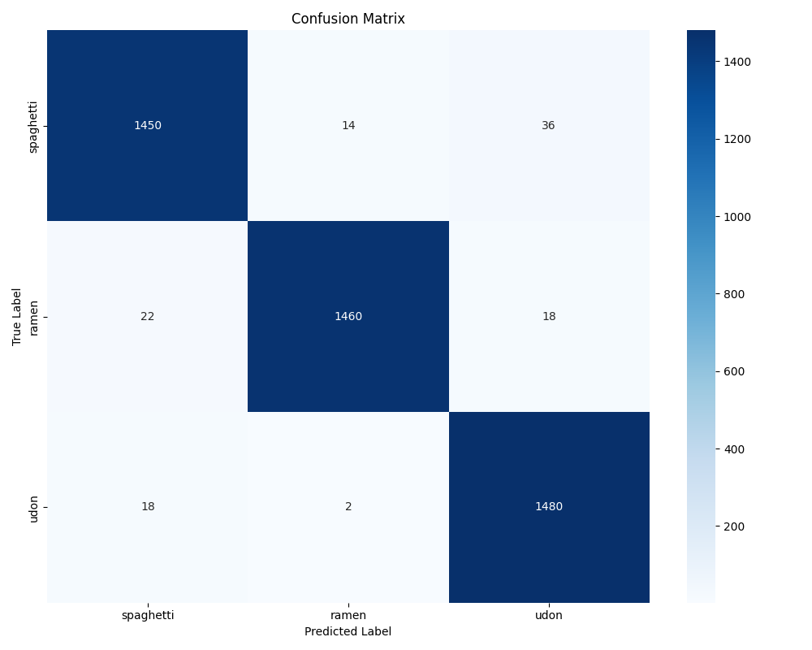
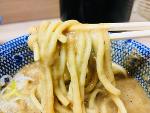
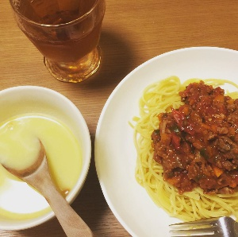
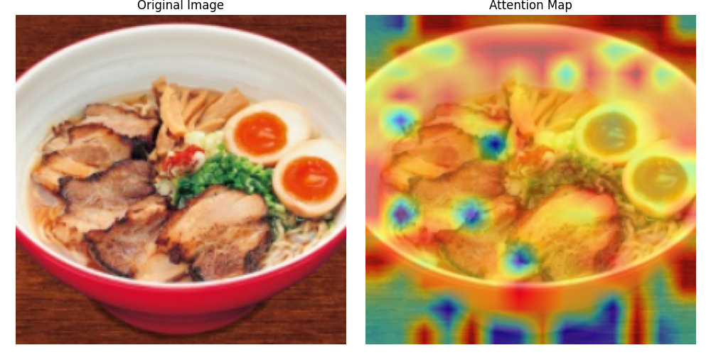
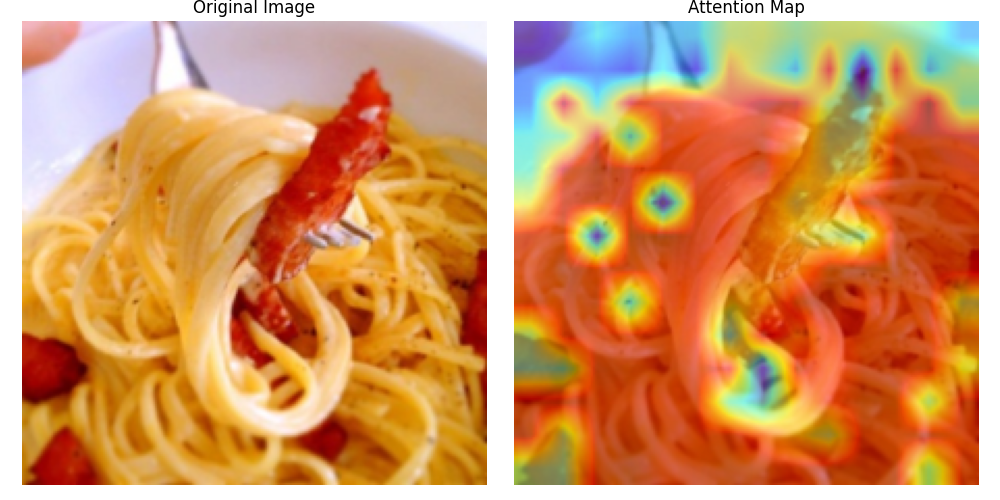
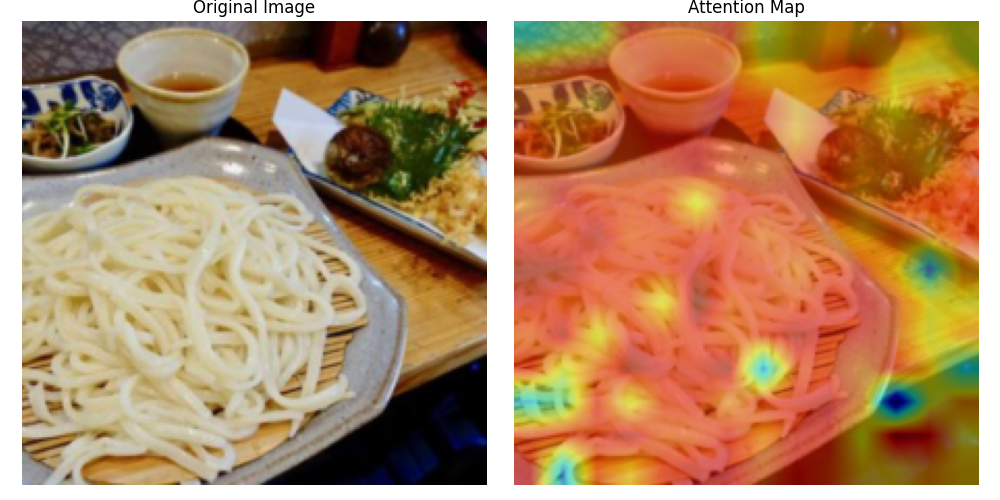
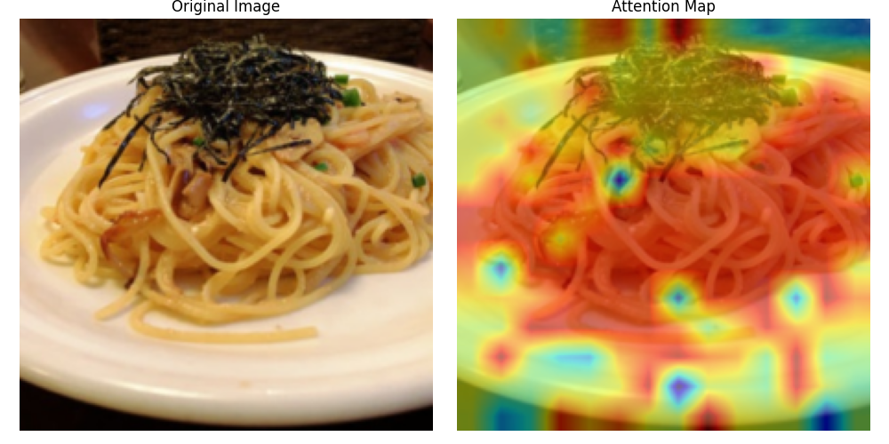
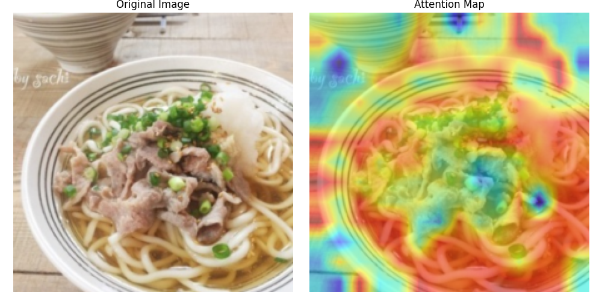

# 麵條分類模型報告

## 1. 模型架構與訓練方法

### 1.1 模型選擇

本專案使用了 Vision Transformer (ViT) 模型的 `vit_large_patch16_224` 版本。這個模型最初由 Dosovitskiy 等人在論文 "An Image is Worth 16x16 Words: Transformers for Image Recognition at Scale" (2020) 中提出[1]。

與其他常見模型相比：

- **ResNet [3]**：
  - 優點：訓練速度快，參數較少
  - 缺點：對全局特徵的捕捉能力較弱
- **EfficientNet [4]**：
  - 優點：計算效率高，參數利用率好
  - 缺點：對複雜紋理特徵的提取能力有限
- **ViT**：
  - 優點：
    1. 全局感受野，能更好地捕捉麵條的整體特徵
    2. 自注意力機制能更好地處理不同區域間的關係
    3. 對紋理和形狀特徵的提取能力強
  - 缺點：
    1. 需要較大的訓練數據集
    2. 計算資源需求較高

### 1.2 資料集說明

使用的資料集包含三種麵條類別：義大利麵（spaghetti）、拉麵（ramen）和烏龍麵（udon）。

#### 訓練集

- 義大利麵（spaghetti）：300 張圖片
- 拉麵（ramen）：600 張圖片
- 烏龍麵（udon）：1000 張圖片
- 總計：約 1900 張訓練圖片

#### 測試集

- 總計：4500 張測試圖片

#### 資料增強後的有效訓練集大小

通過資料增強策略，每個訓練樣本可以產生多個變體：

- 隨機裁剪（scale=(0.7, 1.0)）：2 倍
- 水平翻轉：2 倍
- 垂直翻轉：2 倍
- 旋轉（45度）：4 倍
- 顏色調整：2 倍
- 仿射變換：2 倍
- 自動對比度調整：1.2 倍
- 隨機擦除：1.2 倍

因此，每個原始訓練樣本可以產生 15.4 個變體（2 × 2 × 2 × 4 × 2 × 2 × 1.2 × 1.2 = 15.4），使得有效訓練集大小達到約 29,260 張圖片（1900 × 15.4）。這種資料增強策略不僅擴大了訓練集規模，還提高了模型對各種變化的穩定性。

### 1.3 資料預處理與增強

訓練過程中採用了豐富的資料增強策略：

```python
train_transform = transforms.Compose([
    transforms.RandomResizedCrop(224, scale=(0.7, 1.0)),
    transforms.RandomHorizontalFlip(),
    transforms.RandomVerticalFlip(),
    transforms.RandomRotation(45),
    transforms.ColorJitter(brightness=0.3, contrast=0.3, saturation=0.3, hue=0.1),
    transforms.RandomAffine(degrees=0, translate=(0.1, 0.1), scale=(0.9, 1.1)),
    transforms.RandomAutocontrast(p=0.2),
    transforms.ToTensor(),
    transforms.Normalize([0.485, 0.456, 0.406], [0.229, 0.224, 0.225]),
    transforms.RandomErasing(p=0.2)
])
```

這些增強策略的優勢：

1. 提高模型對不同角度、大小和位置的麵條的識別能力
2. 增強模型對光照變化的穩定性
3. 通過隨機擦除提高模型對部分遮擋的處理能力
4. 使用標準化確保訓練穩定性

### 1.4 訓練策略

本專案採用了多種訓練策略來提高模型性能：

1. **Mixup 數據增強**（alpha=0.8）

   - 將兩張圖片按比例混合，標籤也相應混合
   - 例如：將 80% 的義大利麵圖片和 20% 的拉麵圖片混合，標籤為 [0.8, 0.2, 0]
   - 目的：提高模型對類別間過渡區域的處理能力
2. **標籤平滑**（smoothing=0.1）

   - 將硬標籤（如 [1, 0, 0]）轉換為軟標籤（如 [0.9, 0.05, 0.05]）
   - 目的：防止模型過度自信，提高泛化能力
3. **AdamW 優化器**（lr=2e-5, weight_decay=0.05）

   - 學習率：2e-5（較小的學習率確保模型穩定訓練）
   - 權重衰減：0.05（防止過擬合，但這邊的衰減會被下方的余弦退火覆蓋）
   - 目的：在訓練速度和模型穩定性之間取得平衡
4. **余弦退火學習率調度**

   - 學習率從初始值逐漸降低到接近零
   - 例如：從 2e-5 開始，在第 30 個 epoch 時降至接近 0
   - 目的：幫助模型在訓練後期找到更好的局部最優解
5. **批次大小為 32**

   - 每批次處理 32 張圖片
   - 目的：在訓練穩定性和計算效率之間取得平衡
6. **訓練 30 個 epoch**

   - 最佳驗證準確率出現在第 9 個 epoch
   - 目的：確保模型充分學習，同時避免過擬合

## 2. 模型性能分析

### 2.1 混淆矩陣



### 2.2 測試結果分析

總體準確率 (F1-score): 97.56%

| 類別      | Precision | Recall | F1-score | Support |
| --------- | --------- | ------ | -------- | ------- |
| spaghetti | 0.97      | 0.97   | 0.97     | 1500    |
| ramen     | 0.99      | 0.97   | 0.98     | 1500    |
| udon      | 0.96      | 0.99   | 0.98     | 1500    |

### 2.3 錯誤案例分析

#### 案例一：Ramen 誤判為 Udon



可能原因：

1. 麵比較粗
2. 湯汁的濃稠度使麵條的紋理特徵不明顯

#### 案例二：Spaghetti 誤判為 Ramen



可能原因：

1. 義大利麵的擺盤方式與拉麵中的沾面相似
2. 濃湯的顏色和濃稠度與拉麵湯汁相近

## 3. 模型可解釋性分析

### 3.1 注意力機制分析

本專案使用了 Vision Transformer 的注意力機制來分析模型的可解釋性。這種方法最早由 Vaswani 等人在論文 "Attention Is All You Need" (2017) 中提出[2]，後來被 Dosovitskiy 等人成功應用到視覺領域[1]。

注意力機制的數學表達式如下：

1. **自注意力計算**：

   ```
   Attention(Q, K, V) = softmax(QK^T/sqrt(d_k))V
   ```

   其中：

   - Q, K, V 分別代表查詢（Query）、鍵（Key）和值（Value）矩陣
   - d_k 是鍵向量的維度
   - softmax 用於將注意力分數轉換為概率分布
2. **多頭注意力**：

   ```
   MultiHead(Q, K, V) = Concat(head_1, ..., head_h)W^O
   ```

   其中每個頭的計算為：

   ```
   head_i = Attention(QW^Q_i, KW^K_i, VW^V_i)
   ```
3. **位置編碼**：

   ```
   PE_(pos,2i) = sin(pos/10000^(2i/d_model))
   PE_(pos,2i+1) = cos(pos/10000^(2i/d_model))
   ```

我們主要關注最後一層 transformer block 的注意力權重：

1. 提取 QKV 矩陣
2. 計算注意力分數
3. 應用 softmax 得到注意力權重
4. 對多個注意力頭進行平均
5. 將注意力圖映射回原始圖像大小

### 3.2 注意力圖分析







從注意力圖可以看出：

1. 模型主要關注麵條的主體部分
2. 其次則關注其他配菜(沾醬、湯)
3. 較不關注碗、盤、桌子、肉

## 參考文獻

1. Dosovitskiy, A., Beyer, L., Kolesnikov, A., Weissenborn, D., Zhai, X., Unterthiner, T., ... & Houlsby, N. (2020). An image is worth 16x16 words: Transformers for image recognition at scale. arXiv preprint arXiv:2010.11929.
2. Vaswani, A., Shazeer, N., Parmar, N., Uszkoreit, J., Jones, L., Gomez, A. N., ... & Polosukhin, I. (2017). Attention is all you need. Advances in neural information processing systems, 30.
3. He, K., Zhang, X., Ren, S., & Sun, J. (2016). Deep residual learning for image recognition. Proceedings of the IEEE conference on computer vision and pattern recognition, 770-778.
4. Tan, M., & Le, Q. (2019). Efficientnet: Rethinking model scaling for convolutional neural networks. International conference on machine learning, 6105-6114.
